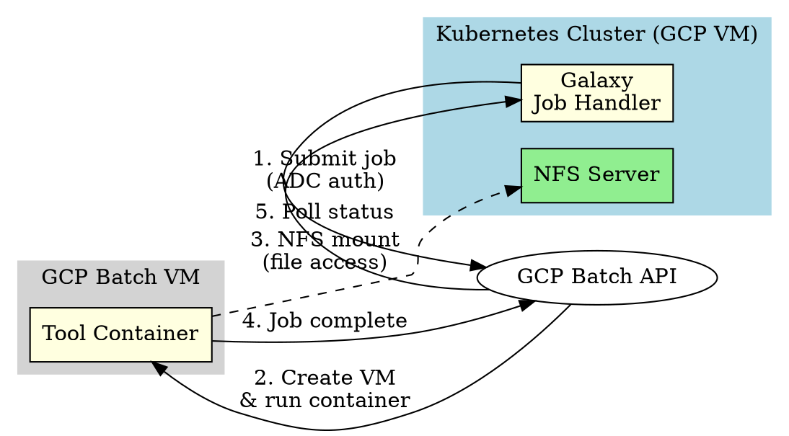
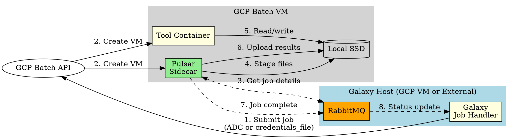
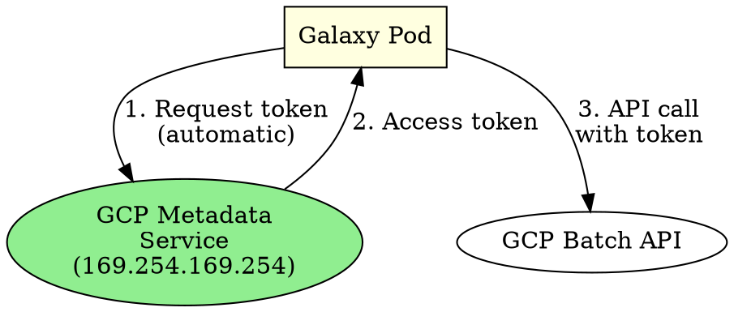
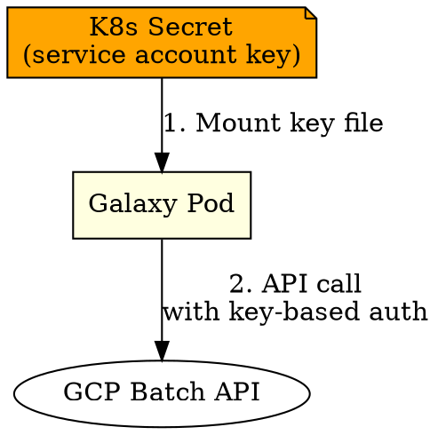

# Pulsar GCP Batch Runner: Missing Dynamic Resource Sizing

**Date**: 2026-01-10
**Reporter**: Keith Suderman
**Affects**: `pulsar` library, GCP Batch integration

## Summary

The Pulsar GCP Batch runner (`PulsarGcpBatchJobRunner`) does not dynamically size VMs based on job resource requirements. When a Galaxy job requests specific CPU/memory resources (e.g., 8 cores), the GCP Batch VM is created with a fixed `machine_type` regardless of the job's actual resource needs.

## Current Behavior

When submitting a FastQC job requesting 8 cores:
- **Expected**: GCP Batch VM sized appropriately (e.g., `n2-standard-8` with 8 vCPUs)
- **Actual**: GCP Batch VM uses fixed `machine_type` from destination config (e.g., `n2-standard-2` with 1 vCPU per task)

## Technical Details

### Affected Code

**File**: `pulsar/client/container_job_config.py`

The `GcpJobParams` class (lines 103-129) only supports these parameters:

```python
class GcpJobParams(BaseModel):
    project_id: str
    credentials_file: Optional[str]
    region: str = "us-central1"
    walltime_limit: int = 86400
    retry_count: int = 2
    ssd_name: Optional[str]
    disk_size: int = 375
    machine_type: str = "n1-standard-1"  # Fixed machine type
    labels: Optional[Dict[str, str]]
```

The `gcp_job_template()` function (lines 139-204) uses `params.machine_type` directly without considering job resource requirements:

```python
def gcp_job_template(params: GcpJobParams) -> "batch_v1.Job":
    # ...
    policy = batch_v1.AllocationPolicy.InstancePolicy()
    policy.machine_type = params.machine_type  # No dynamic sizing
    # ...
```

### Missing Functionality

1. **No CPU/memory parameters**: `GcpJobParams` doesn't accept `cpu_cores` or `memory_mib` parameters
2. **No resource-to-machine mapping**: No logic to select appropriate `machine_type` based on resource requirements
3. **No ComputeResource usage**: GCP Batch supports `ComputeResource` for specifying CPU/memory directly, but this isn't used

## Comparison with Direct GCP Batch Runner

Galaxy's custom `gcp_batch` runner (`galaxy/jobs/runners/gcp_batch.py`) implements dynamic resource allocation:

- Accepts `requests_cpu`, `requests_memory`, `limits_cpu`, `limits_memory` parameters
- Converts Galaxy resource formats (e.g., `"8"`, `"4Gi"`) to GCP Batch format
- Dynamically sizes VMs based on job requirements
- Sets `GALAXY_SLOTS` and `GALAXY_MEMORY_MB` environment variables

## Proposed Solution

### Option A: Add CPU/Memory Parameters with Machine Type Mapping

Add `cpu_cores` and `memory_mib` parameters to `GcpJobParams` and map them to appropriate machine types:

```python
class GcpJobParams(BaseModel):
    # ... existing fields ...
    cpu_cores: Optional[int] = None
    memory_mib: Optional[int] = None

def select_machine_type(cpu_cores: int, memory_mib: int) -> str:
    """Select appropriate GCP machine type based on resource requirements."""
    # Map to n2-standard series based on cores
    if cpu_cores <= 2:
        return "n2-standard-2"
    elif cpu_cores <= 4:
        return "n2-standard-4"
    elif cpu_cores <= 8:
        return "n2-standard-8"
    # ... etc
```

### Option B: Use GCP Batch ComputeResource

GCP Batch supports specifying resources directly via `ComputeResource`:

```python
compute_resource = batch_v1.ComputeResource()
compute_resource.cpu_milli = cpu_cores * 1000
compute_resource.memory_mib = memory_mib

task.compute_resource = compute_resource
```

This allows GCP Batch to select an appropriate machine type automatically.

### Option C: Hybrid Approach

- Accept both `cpu_cores`/`memory_mib` AND `machine_type`
- If `cpu_cores`/`memory_mib` provided, use `ComputeResource`
- If only `machine_type` provided, use current behavior
- This maintains backward compatibility

## Workaround

Until this is fixed, users can:

1. Create multiple destinations with different `machine_type` values
2. Use TPV rules to route tools to appropriate destinations based on resource requirements

Example:
```yaml
destinations:
  pulsar_gcp_small:
    runner: pulsar_gcp
    machine_type: n2-standard-2
  pulsar_gcp_medium:
    runner: pulsar_gcp
    machine_type: n2-standard-8
  pulsar_gcp_large:
    runner: pulsar_gcp
    machine_type: n2-standard-16
```

## Authentication Considerations

### Architecture Difference from Direct GCP Batch Runner

The Pulsar GCP Batch runner has a different authentication model than the direct GCP Batch runner:

| Aspect | Direct GCP Batch (`gcp_batch`) | Pulsar GCP Batch (`pulsar_gcp`) |
|--------|-------------------------------|--------------------------------|
| **Job Submission** | Galaxy submits directly to GCP Batch API | Galaxy submits to GCP Batch API (not Pulsar sidecar) |
| **Pulsar Role** | N/A | Sidecar on GCP Batch VM for file staging only |
| **Communication** | Direct API calls | RabbitMQ for status/file coordination |
| **Constraint** | Galaxy MUST run on GCP VM (for ADC) | Galaxy can run anywhere with proper credentials |

### Architecture Diagrams (Graphviz DOT)

#### Direct GCP Batch Runner (NFS-based)



#### Pulsar GCP Batch Runner (SSD-based)



#### Authentication Flow: Galaxy on GCP VM (ADC)



#### Authentication Flow: Galaxy External (Credentials File)



To generate PNG images from these diagrams:
```bash
dot -Tpng direct_gcp_batch.dot -o direct_gcp_batch.png
dot -Tpng pulsar_gcp_batch.dot -o pulsar_gcp_batch.png
dot -Tpng auth_adc.dot -o auth_adc.png
dot -Tpng auth_credentials.dot -o auth_credentials.png
```

### When Galaxy is NOT on a GCP VM

If Galaxy runs outside of GCP (e.g., on-premises, AWS, Azure):

1. **ADC will not work** - No GCP metadata service available
2. **Must use explicit credentials** - Service account JSON key file required
3. **Configuration required**:
   ```yaml
   execution:
     environments:
       pulsar_gcp:
         runner: pulsar_gcp
         credentials_file: /path/to/service-account-key.json
         project_id: my-gcp-project
         # ... other params
   ```

4. **Security considerations**:
   - Service account key must be securely mounted into Galaxy pods
   - Key rotation becomes a manual process
   - Consider using Workload Identity Federation for cross-cloud scenarios

### Pulsar's Credential Handling

The Pulsar library supports both authentication methods (`pulsar/managers/util/gcp_util.py`):

```python
def gcp_client(credentials_file: Optional[str]) -> "batch_v1.BatchServiceClient":
    if credentials_file:
        # Explicit credentials for non-GCP environments
        credentials = service_account.Credentials.from_service_account_file(credentials_file)
        client = batch_v1.BatchServiceClient(credentials=credentials)
    else:
        # ADC for GCP VM environments
        client = batch_v1.BatchServiceClient()
    return client
```

## References

- GCP Batch ComputeResource documentation: https://cloud.google.com/batch/docs/reference/rest/v1/projects.locations.jobs#ComputeResource
- Galaxy GCP Batch runner (dynamic sizing implementation): `galaxy/jobs/runners/gcp_batch.py`
- Pulsar GCP Batch code: `pulsar/client/container_job_config.py`
- GCP Workload Identity Federation: https://cloud.google.com/iam/docs/workload-identity-federation
