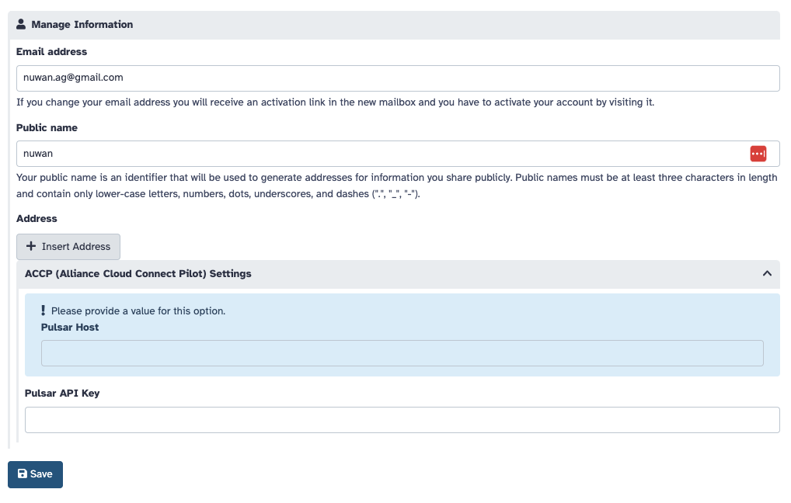

# Integrating with CloudMC

To integrate with CloudMC, three main steps are required.

1.  When the VM is launched, root file system should be at least 30GB, port 80 must be open, and on AWS, metadata service v1 should be enabled.

2.  Block storage should be attached and mounted at `/mnt/block_storage`. The minimum size of the disk should be 100GB.
    Sample script:

    ```bash
    sudo mkfs -t ext4 /dev/nvme1n1
    sudo mkdir /mnt/block_storage
    sudo mount /dev/nvme1n1 /mnt/block_storage
    ```

    Both Galaxy and Pulsar will use this path for storing persistent data.

3.  The `bin/init_script.sh` file contains the user-data that should be used at VM startup.
    This user-data script will initiate setup of Galaxy or Pulsar. The `APPLICATION` environment variable
    must be set in this script to either 'galaxy' or 'pulsar', depending on whether the user selected 'private_galaxy'
    or 'add_capacity_to_galaxy'. Additional configuration steps for each application type is detailed below.

## Additional configuration when APPLICATION='galaxy'

If 'galaxy' is specified as the application type, the 'GALAXY_API_KEY' environment variable must be set to specify the bootstrap api key for the Galaxy
instance. Once the script execution completes, the Galaxy application will start up and start responding on port 80 in approximately 5 minutes.
At this point, CloudMC can register the admin user and create Galaxy additional users as required using the bootstrap API key.

## Additional configuration when APPLICATION='pulsar'

If 'pulsar' was specified, the playbook will setup Pulsar instead. Specify the `PULSAR_API_KEY` environment variable in this case to a uniquely generated password.
Upon completion of the playbook, Pulsar will respond on port 80 in approximately 2-3 minutes. CloudMC will then need to convey the `PULSAR_API_KEY` and the
ip address/host name of the Pulsar instance to usegalaxy.ca, so that usegalaxy.ca can start routing jobs to it.

This can be done using the BioBlend API, using the sample code below. The `PULSAR_HOST` and `PULSAR_API_KEY` can be saved to the corresponding user's
preferences in Galaxy as key-value pairs.

```python
from bioblend.galaxy import GalaxyInstance

# Initialize GalaxyInstance with the Galaxy server URL and the bootstrap admin API key
galaxy_url = "https://usegalaxy.ca"
admin_api_key = "preshared_admin_api_key"
gi_bootstrap = GalaxyInstance(url=galaxy_url, key=admin_api_key)

def set_user_preference(galaxy_instance, user_email, preference_key, preference_value):
    """
    Update a specific user's preferences.
    """
    users = galaxy_instance.users.get_users(f_email=user_email)
    if not users:
        print(f"User with email {user_email} not found.")
        return

    user_id = users[0]['id']
    user_data = {preference_key: preference_value}

    try:
        result = galaxy_instance.users.update_user(user_id, user_data=user_data)
        print(f"Successfully updated preferences for user {user_email}: {result}")
    except Exception as e:
        print(f"Failed to update preferences for user {user_email}: {e}")

# Update the desired user's preferences
user_email = "cilogon_email_address@gmail.com"
set_user_preference(gi_bootstrap, user_email, "accp|pulsar_host", "http://<public_ip_or_hostname_of_instance>/")
set_user_preference(gi_bootstrap, user_email, "accp|pulsar_api_key", "<PULSAR_API_KEY>")
```

## Configuring Galaxy to accept ACCP settings

In order to save custom user preferences as shown above, the Galaxy instance must have already been configured to accept
such custom user preferences. This can be done by:

1. Specifying the `user_preferences_extra_conf_path` in `galaxy.yml`:

    ```yaml
    user_preferences_extra_conf_path: user_preferences_extra_conf.yml
    ```

2. Adding the following settings to `user_preferences_extra_conf.yml`:

    ```yaml
    preferences:
        accp:
            description: ACCP (Alliance Cloud Connect Pilot) Settings
            inputs:
                - name: pulsar_host
                  label: Pulsar Host
                  type: text
                  required: False
                - name: pulsar_api_key
                  label: Pulsar API Key
                  type: text
                  required: False
    ```

Once configured, the user preferences will be visible in Galaxy under User -> Preferences -> Manage Information.


